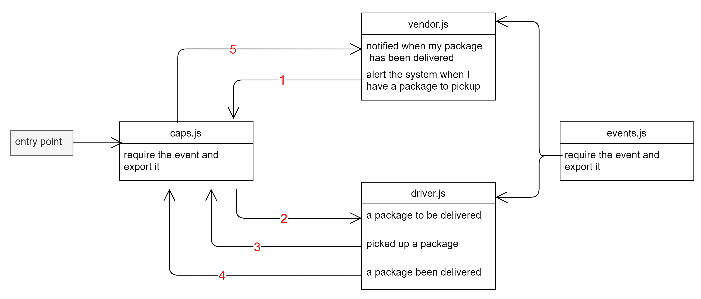

# caps

this project is a practice prioject for lab 11 of 401 course at asac

- **Author** : hiba salem

- ### description

Authentication Server Phase 3: Role Based Access Control

---

- ### NML



---

- ### [PR](https://github.com/hibasalem/caps/pull/1)

---

- ### deploy links

  - [deployment](https://hibacaps.herokuapp.com)

  - [tests report](https://github.com/hibasalem/caps/actions)

---

- ### getting this app

  - clone and npm i
  - npm start or nodemon

---

- ### test this app

  - clone and npm i -D.
  - npm test

---

- ### Setup

  `.env ` requirements

  - `storeName` - any

---

- ### expected output

  ```
    Vindor : i have a package  {
    Event: 'i have a package',
    time: '7/11/2021, 10:41:09 PM',
    payload: {
        storeName: 'hiba-store',
        orderId: '8439e4ab-395f-4c69-a4a6-50cae17c5db4',
        customerName: 'Deven Rogahn',
        address: ' Apt. 555 ,Yucaipa ,Switzerland'
    }
    }
    DRIVER: picked up 8439e4ab-395f-4c69-a4a6-50cae17c5db4
    DRIVER {
    Event: 'in-transit',
    time: '7/11/2021, 10:41:10 PM',
    payload: {
        storeName: 'hiba-store',
        orderId: '8439e4ab-395f-4c69-a4a6-50cae17c5db4',
        customerName: 'Deven Rogahn',
        address: ' Apt. 555 ,Yucaipa ,Switzerland'
    }
    }
    DRIVER: delivered  8439e4ab-395f-4c69-a4a6-50cae17c5db4
    Vindor :  Thank you for delivering 8439e4ab-395f-4c69-a4a6-50cae17c5db4 {
    Event: 'delivered',
    time: '7/11/2021, 10:41:12 PM',
    payload: {
        storeName: 'hiba-store',
        orderId: '8439e4ab-395f-4c69-a4a6-50cae17c5db4',
        customerName: 'Deven Rogahn',
        address: ' Apt. 555 ,Yucaipa ,Switzerland'
    }
    }
  ```
